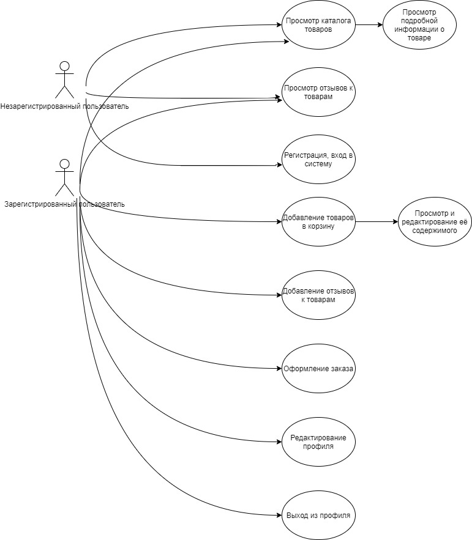
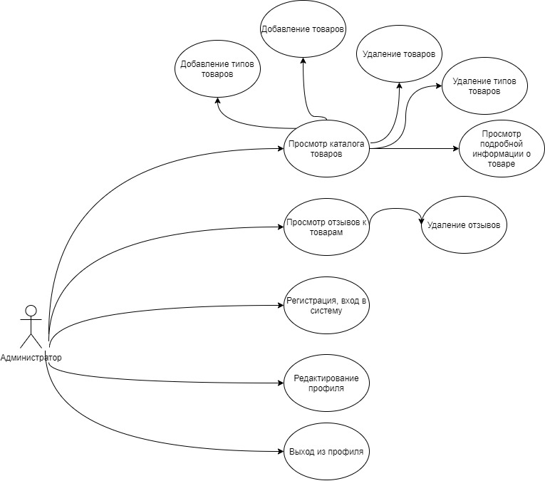
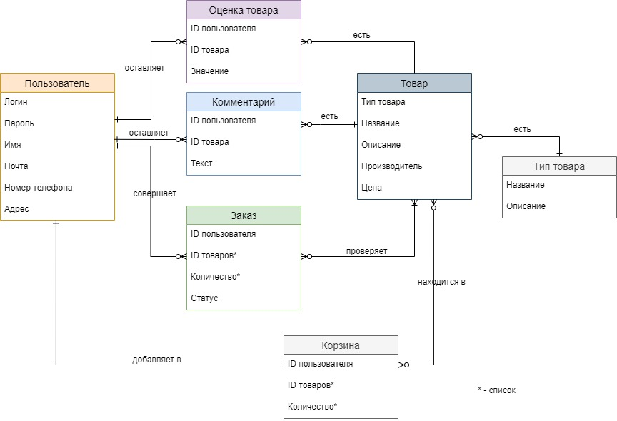

# ArtShop
## Большой выбор товаров для хобби и творчества
Основным направлением магазина являются товары для хобби и творчества, начиная от материалов, например, красок, холстов, бумаги, деревянных заготовк, глины, ткани, и заканчивая простыми и сложными "инструментами": кистями, мольбертами, аппаратами для выжигания и др.
### Цель работы
Создание RESTFul API приложения-магазина для продажи товаров для хобби и творчества.
### Предоставляемая возможность
Обычные и необходимые действия для покупки товаров в интернет-магазинах: выбор товаров из каталога товаров, добавление их в корзину и оформление заказа.
### Краткий перечень функциональных требований:
Пользователь должен иметь следующие возможности:
* просматривать каталог товаров;
* добавлять товары в корзину;
* оценивать товары -- данные оценки являются анонимными;
* оставлять комментарии -- поскольку тематика магазина не предполагает высокой активности покупателей в комментариях, не предполагается сохранение информации о времени размещения комментария, кроме даты; из этого следует, что не гарантируется хронологический вывод комментариев на странице товара в рамках одной даты; 
* просматривать содержимое корзины;
* оформлять заказ.

Администратор магазина должен иметь следующие возможности:

## Диаграмма пользовательских сценариев системы

## ER-диаграмма сущностей системы

